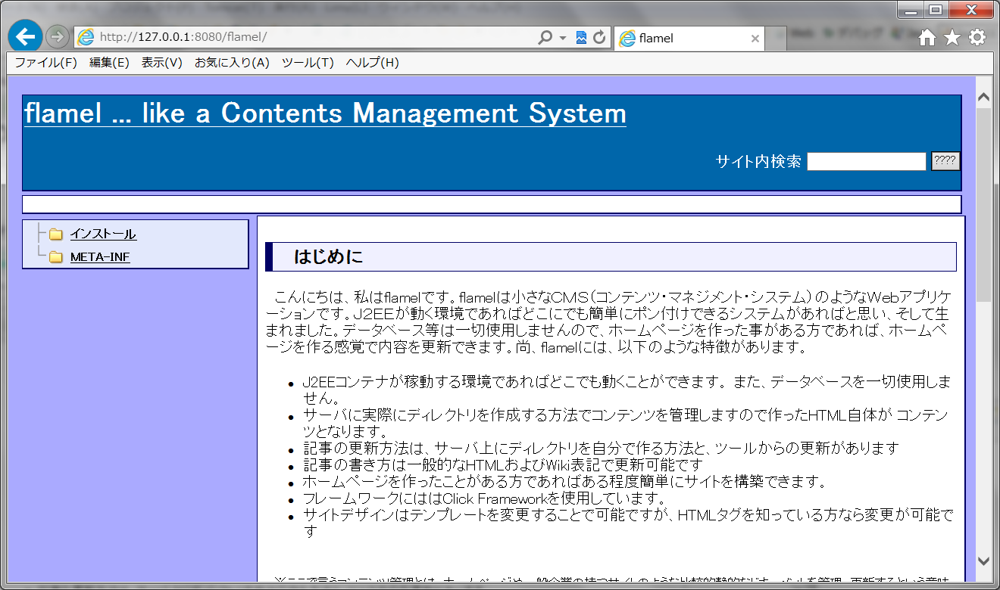

flamel
======

Click Frameworkで作った小さなコンテンツマネジメントシステムです

　こんにちは、私はflamelです。flamelは小さなＣＭＳ（コンテンツ・マネジメント・システム）のようなＷｅｂアプリケーションです。Ｊ２ＥＥが動く環境であればどこにでも簡単にポン付けできるシステムがあればと思い、そして生まれました。データベース等は一切使用しませんので、ホームページを作った事がある方であれば、ホームページを作る感覚で内容を更新できます。尚、flamelには、以下のような特徴があります。

<ul>
<li>J2EEコンテナが稼動する環境であればどこでも動くことができます。 また、データベースを一切使用しません。</li>
<li>サーバに実際にディレクトリを作成する方法でコンテンツを管理しますので作ったHTML自体が コンテンツとなります。 </li>
<li>記事の更新方法は、サーバ上にディレクトリを自分で作る方法と、ツールからの更新があります </li>
<li>記事の書き方は一般的なHTMLおよびWiki表記で更新可能です </li>
<li>ホームページを作ったことがある方であればある程度簡単にサイトを構築できます。 </li>
<li>フレームワークにははClick Frameworkを使用しています。 </li>
<li>サイトデザインはテンプレートを変更することで可能ですが、HTMLタグを知っている方なら変更が可能です </li>
</ul>

 　※ここで言うコンテンツ管理とは、ホームページや一般企業の持つサイトのような比較的静的なドキュメントを管理、更新するという意味での管理です。

<h3>どんな管理ができるのか</h3>

 　flamelにおいてはWikiやブログのような時間管理が得意ではありません。逆に、はじめにカテゴリ（ディレクトリ）を決めて、そのドキュメントを更新するタイプは比較的得意な分野です。まぁ、「簡易cmsみたいなもの」なんで仕方がありませんが。 

<h3>とりあえず、動かしてみたい</h3>

flamel.warをダウンロードして、JEEコンテナに配置してください。

